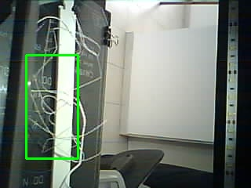

## 3D Printing Failure Detection API
Adaptation from Obico (https://www.obico.io/) with new endpoint methods. Developed with the goald of adding spaghetti detector as a feature for my Information Systems Engineering thesis, which consided in a 3D Printing Services asset manager. 

The SPD object detection model is adapted from YOLOv2 architecture.

